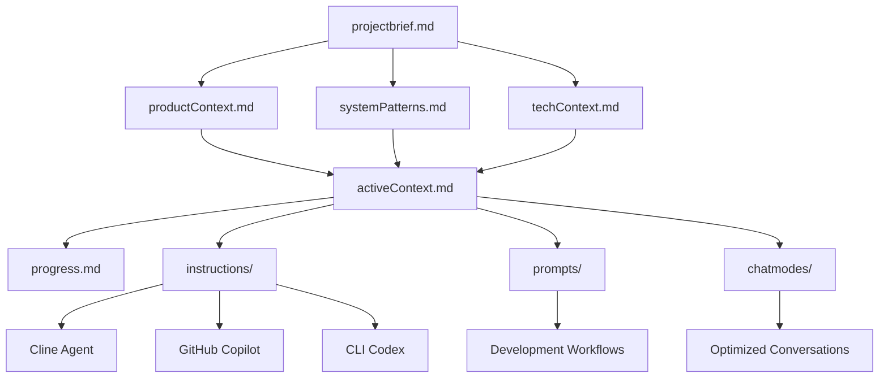

# Genesis 10 - AI Agent Coordination Template

A comprehensive project template optimized for multi-AI agent development workflows, featuring an advanced Memory Bank system for seamless coordination between Cline, GitHub Copilot, and CLI Codex.

## 🚀 Quick Start

### For New Projects
```bash
# Clone this template
git clone <repository-url> my-new-project
cd my-new-project

# Initialize memory bank for your project
./scripts/memory-bank-init.sh "My Awesome Project"

# Validate setup
./scripts/memory-bank-validate.sh --verbose
```

### For Existing Projects
```bash
# Copy memory bank structure
cp -r memory-bank/ /path/to/existing/project/
cp .clinerules /path/to/existing/project/
cp scripts/memory-bank-*.sh /path/to/existing/project/scripts/

# Customize for your project
cd /path/to/existing/project
./scripts/memory-bank-validate.sh --fix
```

## 🧠 Memory Bank System

The Memory Bank is a revolutionary approach to AI agent coordination that ensures consistent context, patterns, and knowledge across all development tools.

### Core Philosophy

> **"Every AI agent should understand the project as deeply as the developer"**

The Memory Bank achieves this by maintaining a comprehensive, structured knowledge base that serves as the single source of truth for all AI agents working on the project.

### Architecture Overview



## 📁 Project Structure

```
genesis_10/
├── .clinerules                          # Cline's project intelligence
├── README.md                            # This file
├── memory-bank/                         # AI Agent coordination hub
│   ├── projectbrief.md                  # Foundation: scope, requirements
│   ├── productContext.md                # User experience and business context
│   ├── activeContext.md                 # Current work focus and decisions
│   ├── systemPatterns.md                # Architecture and technical patterns
│   ├── techContext.md                   # Technology stack and environment
│   ├── progress.md                      # Status tracking and lessons learned
│   ├── instructions/                    # Cross-agent coordination
│   │   ├── shared.instructions.md       # Common standards for all agents
│   │   ├── cline.instructions.md        # Cline-specific workflows
│   │   ├── copilot.instructions.md      # GitHub Copilot integration
│   │   └── codex.instructions.md        # CLI automation patterns
│   ├── prompts/                         # Workflow templates
│   │   ├── initialization.prompt.md     # Project setup template
│   │   ├── development.prompt.md        # Feature development workflow
│   │   └── memory-update.prompt.md      # Memory bank maintenance
│   └── chatmodes/                       # Context-specific conversations
├── scripts/                             # Automation and validation
│   ├── memory-bank-validate.sh          # Memory bank integrity validation
│   ├── memory-bank-init.sh              # New project initialization
│   └── system-info.sh                   # Environment information
├── src/                                 # Source code
├── lib/                                 # Shared libraries
├── web/                                 # Web assets
├── python/                              # Python modules
└── notebooks/                           # Jupyter notebooks
```

## 🤖 AI Agent Coordination

### Supported AI Agents

#### 🔧 Cline
- **Primary Role**: Architecture, file operations, complex logic
- **Strengths**: Memory bank maintenance, cross-file changes, system design
- **Integration**: Reads entire memory bank at session start
- **Instructions**: `memory-bank/instructions/cline.instructions.md`

#### 💡 GitHub Copilot
- **Primary Role**: Real-time code completion and suggestions
- **Strengths**: Pattern following, boilerplate generation, inline assistance
- **Integration**: Follows documented patterns and conventions
- **Instructions**: `memory-bank/instructions/copilot.instructions.md`

#### ⚡ CLI Codex
- **Primary Role**: Command generation and automation
- **Strengths**: Script creation, environment management, build automation
- **Integration**: Generates commands based on documented environment
- **Instructions**: `memory-bank/instructions/codex.instructions.md`

### Coordination Principles

1. **Shared Context**: Memory bank provides unified project understanding
2. **Complementary Roles**: Each agent has specialized strengths
3. **Pattern Consistency**: All agents follow documented conventions
4. **Quality Alignment**: Unified standards across all outputs

## 🛠️ Memory Bank Management

### Daily Workflows

#### Starting a Session
```bash
# Validate memory bank integrity
./scripts/memory-bank-validate.sh

# Read current context (for Cline)
# Memory bank files are automatically loaded
```

#### During Development
```bash
# Quick validation during work
./scripts/memory-bank-validate.sh

# Update memory bank after major changes
# Use memory-update.prompt.md template
```

#### Ending a Session
```bash
# Comprehensive validation
./scripts/memory-bank-validate.sh --verbose

# Ensure all changes are documented
# Update activeContext.md and progress.md
```

### Maintenance Commands

```bash
# Validate memory bank
./scripts/memory-bank-validate.sh                # Quick check
./scripts/memory-bank-validate.sh --verbose     # Detailed analysis
./scripts/memory-bank-validate.sh --fix         # Auto-fix missing files

# Initialize new project
./scripts/memory-bank-init.sh "Project Name"    # Create new structure

# Quick aliases (add to ~/.bashrc or ~/.zshrc)
alias mb-validate="./scripts/memory-bank-validate.sh"
alias mb-validate-fix="./scripts/memory-bank-validate.sh --fix"
alias mb-validate-verbose="./scripts/memory-bank-validate.sh --verbose"
```

## 📋 Development Workflows

### 1. Project Initialization
```bash
# Use initialization prompt template
# Fill in: memory-bank/prompts/initialization.prompt.md
# Update: projectbrief.md, techContext.md, productContext.md
```

### 2. Feature Development
```bash
# Use development prompt template
# Fill in: memory-bank/prompts/development.prompt.md
# Coordinate: Cline (architecture) + Copilot (code) + Codex (automation)
```

### 3. Memory Bank Updates
```bash
# Use memory update prompt template
# Fill in: memory-bank/prompts/memory-update.prompt.md
# Review: All memory bank files for consistency
```

## 🔍 Quality Assurance

### Automated Validation

The memory bank includes automated validation to ensure:
- ✅ All required files exist
- ✅ Files have sufficient content
- ✅ Markdown formatting is correct
- ✅ Cross-references are maintained
- ✅ Directory structure is complete

### Manual Quality Checks

1. **Consistency**: All files reference the same project goals
2. **Currency**: Information matches actual implementation
3. **Completeness**: All major decisions are documented
4. **Clarity**: Information supports effective AI coordination

## 🚀 Advanced Features

### Cross-Agent Prompt Templates
Standardized prompt templates ensure consistent workflows across different AI agents and development phases.

### Automated Memory Bank Validation
Scripts validate memory bank integrity and automatically detect inconsistencies or missing information.

### Modular Architecture
The system is designed to be extensible, allowing easy addition of new AI agents and workflow patterns.

### Version Control Integration
All memory bank changes are tracked in version control, providing a complete history of project evolution.

## 🎯 Benefits

### For Developers
- **Reduced Context Switching**: AI agents understand project immediately
- **Consistent Quality**: All agents follow same patterns and standards
- **Faster Onboarding**: New team members get complete context quickly
- **Better Coordination**: Multiple AI tools work together seamlessly

### For Projects
- **Accelerated Development**: AI agents work more effectively with context
- **Improved Quality**: Consistent patterns reduce bugs and technical debt
- **Better Documentation**: Knowledge is captured and maintained automatically
- **Scalable Processes**: System grows with project complexity

### For Teams
- **Knowledge Preservation**: Critical decisions and patterns are documented
- **Seamless Handoffs**: Context transfers perfectly between sessions
- **Reduced Miscommunication**: Single source of truth for all agents
- **Enhanced Productivity**: AI agents require less guidance and correction

## 🔧 Customization

### Adding New AI Agents
1. Create instruction file: `memory-bank/instructions/newagent.instructions.md`
2. Update shared instructions with coordination patterns
3. Add agent-specific prompt templates if needed
4. Update validation script to include new files

### Project-Specific Extensions
1. Add specialized directories under `memory-bank/`
2. Create custom prompt templates for unique workflows
3. Extend automation scripts for project-specific needs
4. Update `.clinerules` with project intelligence

### Integration with Existing Tools
1. Copy memory bank structure to existing project
2. Customize templates for existing codebase
3. Update technology context with current stack
4. Run validation to ensure completeness

## 📚 Documentation

### Core Files Documentation
- `memory-bank/projectbrief.md` - Foundation document defining project scope
- `memory-bank/activeContext.md` - Current work focus and recent decisions
- `memory-bank/systemPatterns.md` - Architecture and technical patterns
- `.clinerules` - Cline's project-specific intelligence

### Template Documentation
- `memory-bank/prompts/` - Workflow templates for common development tasks
- `memory-bank/instructions/` - AI agent coordination guidelines
- `memory-bank/chatmodes/` - Context-specific conversation patterns

### Automation Documentation
- `scripts/memory-bank-validate.sh` - Validation and integrity checking
- `scripts/memory-bank-init.sh` - New project initialization

## 🤝 Contributing

When contributing to projects using this template:

1. **Read Memory Bank**: Start by reading all memory bank files
2. **Follow Patterns**: Use established patterns and conventions
3. **Update Documentation**: Keep memory bank current with changes
4. **Validate Changes**: Run validation before committing
5. **Coordinate with AI**: Use instruction files to guide AI agents

## 📄 License

This template is designed to be freely used and adapted for any project. The Memory Bank system and coordination patterns can be applied to projects of any size and technology stack.

## 🔗 Related Resources

- [Cline Documentation](https://docs.cline.bot/)
- [GitHub Copilot Documentation](https://docs.github.com/en/copilot)
- [OpenAI Codex Documentation](https://openai.com/blog/openai-codex/)

---

**Genesis 10** - Optimizing human-AI collaboration through intelligent project organization and seamless multi-agent coordination.
